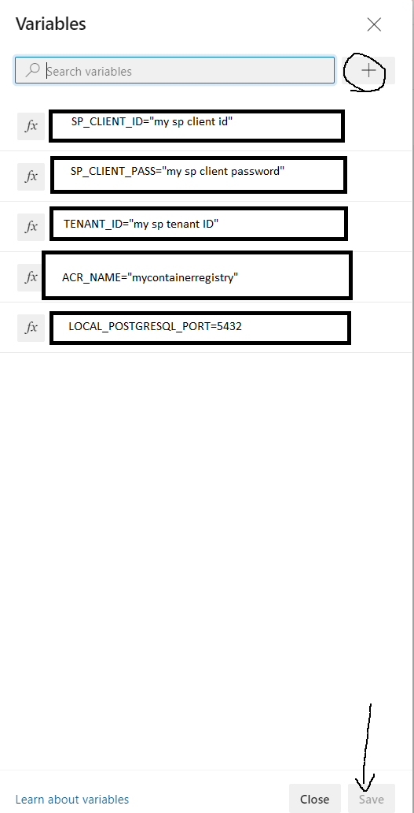
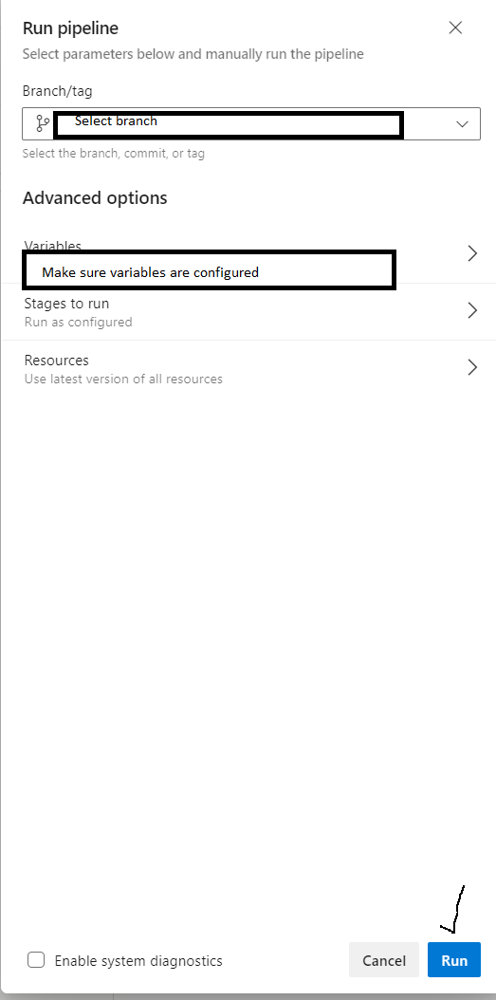

# Azure DevOps Build Pipeline

The purpose of this [Azure DevOps Pipeline](../pipeline.yaml) is to build `Indexd`, run a test suite, and then push the `indexd` container into an [Azure Container Registry](https://docs.microsoft.com/en-us/azure/container-registry/container-registry-get-started-portal).

## Getting Started

If you don't already have access, you can use the free sign up with [Azure Devops](https://docs.microsoft.com/en-us/azure/devops/pipelines/get-started/pipelines-sign-up?view=azure-devops).

You can also import the [pipeline](../pipeline.yaml), see these [doc notes](https://docs.microsoft.com/en-us/azure/devops/pipelines/get-started/clone-import-pipeline?view=azure-devops&tabs=yaml#export-and-import-a-pipeline) as a guide.

### Setup Azure Container Registry

[Create a Service Principal](https://docs.microsoft.com/en-us/cli/azure/create-an-azure-service-principal-azure-cli#password-based-authentication) in your Azure Subscription using [Azure CLI](https://docs.microsoft.com/en-us/cli/azure/install-azure-cli).

First, log into `az` cli:

```bash
az login
az account set -s <Subscription ID>
```

You can create a **service principal** in Azure AD:

```bash
spObject=$(az ad sp create-for-rbac --name ServicePrincipalName)

# this can be used for the SP_CLIENT_ID
spClientId=$(echo $spObject | jq -r ".appId")

# this can be used for the SP_CLIENT_PASSWORD
spPassword=$(echo $spObject | jq -r ".password")

# this can be used for the TENANT_ID
spTenantId=$(echo $spObject | jq -r ".tenant")
```

> You will need to have appropriate permissions in the AAD directory.  If you don't have access, please work with your Azure Subscription administrator to obtain a Service Principal.

You can also create an **Azure Container Registry** using [azure cli](https://docs.microsoft.com/en-us/azure/container-registry/container-registry-get-started-azure-cli) or the [portal](https://docs.microsoft.com/en-us/azure/container-registry/container-registry-get-started-portal).

You can use the following `az` cli commands in `bash` for reference:

```bash
az group create --name myResourceGroup --location eastus
az acr create --resource-group myResourceGroup --name myContainerRegistry --sku Basic
```

Also, make sure that the **Service Principal** has rights to the [Azure Container Registry](https://docs.microsoft.com/en-us/azure/container-registry/container-registry-roles?tabs=azure-cli) to **acrPull** and **acrPush**.

```bash
acrResourceId="$(az acr show -n myContainerRegistry -g myResourceGroup --query "id" -o tsv)"

az role assignment create --assignee $spClientId --role 'AcrPull' --scope $acrResourceId

az role assignment create --assignee $spClientId --role 'AcrPush' --scope $acrResourceId
```

To verify if the pipeline context will have access to ACR, you can login.

> Note, this is an approach for dev / test, but in a production scenario, it is more likely that your SP Credentials used in the Azure DevOps Pipeline would be populated as secrets through variables or Variable Groups.

```bash
az login --service-principal --username "$spClientId" --password "$spPassword" --tenant "$spTenantId"

az acr login --name myContainerRegistry
```

You can also verify that this service principal will have `ACRPush` and `ACRPull` permission with ACR, which you can check how the [getting started with docker guide](https://docs.microsoft.com/en-us/azure/container-registry/container-registry-get-started-docker-cli?tabs=azure-cli) for more details.

First, pull and tag an image:

```bash
docker pull mcr.microsoft.com/oss/nginx/nginx:1.15.5-alpine

docker tag mcr.microsoft.com/oss/nginx/nginx:1.15.5-alpine mycontainerregistry.azurecr.io/samples/nginx
```

> Note that the ACR names will default to **lowercase** for the `fqdn`, so make sure that when you're tagging images to use **lowercase** for the ACR name.

Check that you can push an image to ACR:

```bash
docker push mycontainerregistry.azurecr.io/samples/nginx
```

Check that you can pull an image from ACR:

```bash
docker pull mycontainerregistry.azurecr.io/samples/nginx
```

You can also list out the images in the ACR with `az` cli:

```bash
az acr repository list --name mycontainerregistry
```

## Configuring the Pipeline

You can set the variables on your **Azure DevOps pipeline**.

First, make sure you have already [imported your Azure DevOps Pipeline](https://docs.microsoft.com/en-us/azure/devops/pipelines/get-started/clone-import-pipeline?view=azure-devops&tabs=yaml#export-and-import-a-pipeline).

Click on the pipeline and then click edit, which will let you update the variables in the Azure DevOps pipeline:


Variable Name | Description  
------ | ------
SP_CLIENT_ID | This is your Service Principal Client ID.
SP_CLIENT_PASS | This is your Service Principal Password.  You can override this value when running the Azure DevOps pipeline.
TENANT_ID | This is the Azure AD tenant ID where the SP and the ACR reside.
ACR_NAME | This is the Azure Container Registry name.  Note, it is not the **FQDN** (e.g. `myacrname` instead of `myacrname.azurecr.io`).
LOCAL_POSTGRESQL_PORT | This is the Local PostgreSQL Port number.  The default port for a `PostgreSQL` server is `5432`, but you can change this to another port in case this port is already in use on the host. For example you can use `5433`.

After updating the variables, be sure to click **save**:



You can run the pipeline to validate the `indexd` build and push to ACR.

